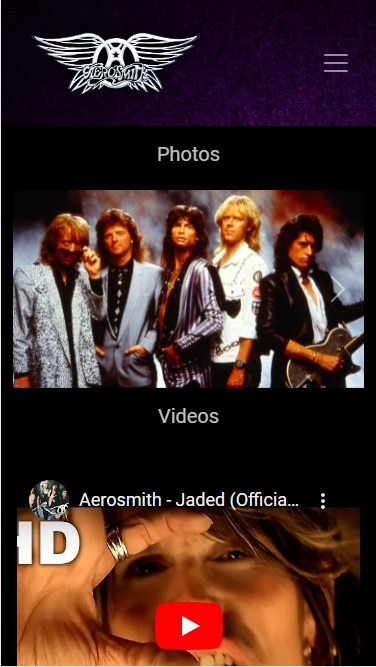

<h1> AerosmithPage </h1>

 This is the website of the American rock band,"Aerosmith", formed in Boston in 1970

<h2> Site structure </h2>

<h3> Index </h3>

 This is the home of the site, it contains information about the band and the members. 

<h3> Media </h3>

 Contains a gallery of photos throughout its history and a gallery of official videos. 

<h3> Music </h3>

 This page contains all the official albums of the band on spotify. 

<h3> Tour </h3>

 All the information about the band's tour with links to buy tickets. 

<h3> Store </h3>

 Official band merchandise and apparel store. 

<h3> Contact </h3>

 This page is for your concerns or comments and also for hiring. 

<h2> Screenshots </h2>

 Some sample mobile screenshots 

<h2> Technologies </h2>

<ul>
<li> HTML </li>
<li> CSS </li>
<li> SASS </li>
</ul>

<h2> Libraries </h2>

<ul>
<li> Bootstrap </li>
<li> Iconify </li>
<li> Animate.style </li>
</ul>
